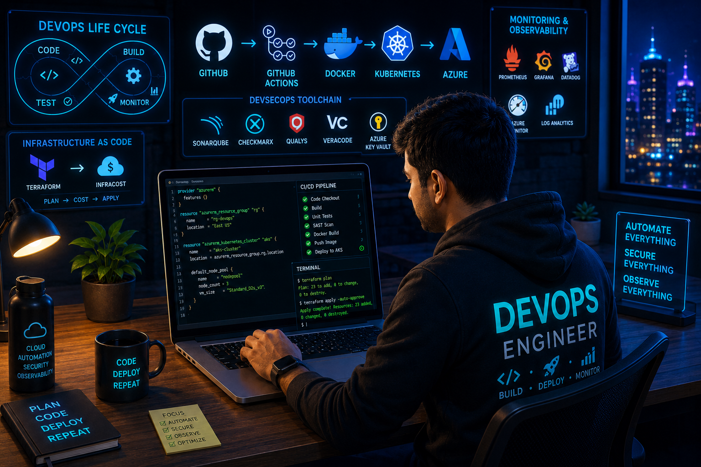

  

    

  

    

  

  

  

<h2 align="center">
  🚀 Senior DevSecOps Engineer
</h2>

  <b>
    Azure Cloud ☁️ • Kubernetes ☸️ • Terraform 🏗️ • GitOps 🔄 • DevSecOps 🛡️
  </b>

<!-- ===================== HERO ===================== -->

 

 

<!-- ===================== ABOUT ===================== -->

<h1 align="center">
  👨‍💻 About Me
</h1>

<table>
<tr>
<td width="50%" valign="top">

<h3>🚀 Senior DevSecOps Engineer</h3>

I am a <b>Senior DevSecOps Engineer</b> with 
<b>9+ years of IT experience</b>, specializing in designing,
automating and securing enterprise cloud-native platforms
on <b>Microsoft Azure</b>.

My core expertise includes <b>Azure, Kubernetes, Terraform,
CI/CD, DevSecOps, GitOps, Cloud Networking, Security,
Observability and Disaster Recovery.</b>

</td>

<td width="50%" valign="top">

<h3>🧠 Engineering Mindset</h3>

<ul>
<li>☁️ Cloud Native Architecture</li>
<li>🏗️ Infrastructure as Code</li>
<li>🔐 Security by Design</li>
<li>🚀 Zero-Downtime Deployment</li>
<li>☸️ Kubernetes & GitOps</li>
<li>📊 Observability First</li>
<li>💰 Cost-Aware Engineering</li>
<li>♻️ Automation Everywhere</li>
</ul>

</td>
</tr>
</table>

 

<!-- ===================== ARCHITECTURE ===================== -->

<h1 align="center">
  ☁️ Azure Cloud Architecture
</h1>

<table>
<tr>
<td align="center">

<b>🌍 Internet</b>

 
⬇
 

<b>Azure Front Door</b>

 
⬇
 

<b>Hub VNet</b>

 

Azure Firewall • VPN Gateway • DNS • Shared Services

</td>

<td align="center">

<b>🔗 VNet Peering</b>

 
⬇
 

<b>Workload Spoke</b>

 

AKS • Application Gateway • Microservices

</td>

<td align="center">

<b>🔐 Data & Platform</b>

 

Azure SQL • Key Vault

 

Private Endpoints • Log Analytics

 

Backup • ASR

</td>
</tr>
</table>

 

 

<!-- ===================== SKILLS ===================== -->

<h1 align="center">
  🛠️ Technology Stack
</h1>

<h3 align="center">☁️ Cloud & Infrastructure</h3>

 

<h3 align="center">🔄 DevOps & GitOps</h3>

 

<h3 align="center">💻 Automation & Scripting</h3>

 

<!-- ===================== SKILL MATRIX ===================== -->

<h2 align="center">⚡ Core Expertise</h2>

<table>

<tr>
<td align="center" width="25%">
<h3>☁️</h3>
<b>Azure</b>
  
AKS 
VNet 
Application Gateway 
Front Door 
Firewall 
VPN 
Azure SQL 
Key Vault
</td>

<td align="center" width="25%">
<h3>🏗️</h3>
<b>Infrastructure</b>
  
Terraform 
Reusable Modules 
Remote State 
Infracost 
Landing Zones 
Policy Enforcement
</td>

<td align="center" width="25%">
<h3>☸️</h3>
<b>Kubernetes</b>
  
AKS 
Docker 
Helm 
AGIC 
ArgoCD 
GitOps 
Microservices
</td>

<td align="center" width="25%">
<h3>🛡️</h3>
<b>Security</b>
  
SonarQube 
CheckMarx 
Qualys 
Veracode 
Key Vault 
Private Endpoints 
Zero Trust
</td>
</tr>

</table>

 

<!-- ===================== DEVSECOPS ===================== -->

<h1 align="center">
  🛡️ DevSecOps Pipeline
</h1>

<table>

<tr>

<td align="center">
<h3>👨‍💻</h3>
<b>Developer</b>
</td>

<td>➡️</td>

<td align="center">
<h3>📦</h3>
<b>GitHub</b>
</td>

<td>➡️</td>

<td align="center">
<h3>⚙️</h3>
<b>CI Pipeline</b>
</td>

<td>➡️</td>

<td align="center">
<h3>🛡️</h3>
<b>Security Gates</b>
</td>

<td>➡️</td>

<td align="center">
<h3>🐳</h3>
<b>Container</b>
</td>

<td>➡️</td>

<td align="center">
<h3>☸️</h3>
<b>AKS</b>
</td>

</tr>

</table>

 

 

<!-- ===================== KUBERNETES ===================== -->

<h1 align="center">
  ☸️ Kubernetes & GitOps
</h1>

<table>
<tr>

<td align="center">
<h2>💻</h2>
<b>Developer</b>
 
Application Code
</td>

<td>➡️</td>

<td align="center">
<h2>📂</h2>
<b>GitHub</b>
 
Source Control
</td>

<td>➡️</td>

<td align="center">
<h2>🔄</h2>
<b>CI/CD</b>
 
Build • Test • Scan
</td>

<td>➡️</td>

<td align="center">
<h2>🐳</h2>
<b>Container Registry</b>
 
Docker Images
</td>

<td>➡️</td>

<td align="center">
<h2>🔱</h2>
<b>ArgoCD</b>
 
GitOps
</td>

<td>➡️</td>

<td align="center">
<h2>☸️</h2>
<b>AKS</b>
 
Production
</td>

</tr>
</table>

 

 

<!-- ===================== TERRAFORM ===================== -->

<h1 align="center">
  🏗️ Infrastructure as Code
</h1>

<table>

<tr>

<td align="center" width="20%">
<h2>📋</h2>
<b>Terraform</b>
 
Reusable Modules
</td>

<td>➡️</td>

<td align="center" width="20%">
<h2>💰</h2>
<b>Infracost</b>
 
Cost Estimation
</td>

<td>➡️</td>

<td align="center" width="20%">
<h2>🔍</h2>
<b>Plan</b>
 
Validation
</td>

<td>➡️</td>

<td align="center" width="20%">
<h2>🚀</h2>
<b>Apply</b>
 
Azure Infrastructure
</td>

</tr>

</table>

 

 

<!-- ===================== SECURITY ===================== -->

<h1 align="center">
  🔐 Security Engineering
</h1>

<table>

<tr>

<td align="center">
<h2>🔑</h2>
<b>Secrets</b>
 
Azure Key Vault
</td>

<td align="center">
<h2>🔒</h2>
<b>Network</b>
 
Private Endpoints
</td>

<td align="center">
<h2>🛡️</h2>
<b>SAST</b>
 
SonarQube 
CheckMarx
</td>

<td align="center">
<h2>⚔️</h2>
<b>DAST</b>
 
Qualys 
Veracode
</td>

<td align="center">
<h2>🚫</h2>
<b>Zero Trust</b>
 
No Public Exposure
</td>

</tr>

</table>

 

<!-- ===================== OBSERVABILITY ===================== -->

<h1 align="center">
  📊 Observability
</h1>

  

<table>
<tr>
<td align="center">
<h3>📈 Metrics</h3>
Prometheus
</td>

<td align="center">
<h3>📊 Dashboards</h3>
Grafana
</td>

<td align="center">
<h3>🔔 Alerting</h3>
Custom Alerts
</td>

<td align="center">
<h3>☁️ Cloud</h3>
Azure Monitor
</td>

<td align="center">
<h3>🔎 Logs</h3>
Log Analytics
</td>
</tr>
</table>

 

<!-- ===================== ACHIEVEMENTS ===================== -->

<h1 align="center">
  🏆 Key Achievements
</h1>

<table>

<tr>

<td width="50%" valign="top">

<h3>🥇 Enterprise Azure Landing Zone</h3>

Production-grade Hub & Spoke architecture using Terraform with:

  

Azure Front Door • Application Gateway • Load Balancers • VPN Gateway • VNet Peering • NSG • UDR

</td>

<td width="50%" valign="top">

<h3>🔐 Zero Public Exposure</h3>

Azure SQL and Key Vault secured using Private Endpoints with sensitive services isolated from public internet exposure.

</td>

</tr>

<tr>

<td width="50%" valign="top">

<h3>🚀 Zero-Downtime Deployment</h3>

Implemented GitOps-based AKS deployments using ArgoCD and Helm with automated synchronization and rollback capabilities.

</td>

<td width="50%" valign="top">

<h3>🛡️ Shift-Left Security</h3>

Integrated SAST and DAST security controls into CI/CD pipelines with automated quality gates.

</td>

</tr>

<tr>

<td width="50%" valign="top">

<h3>💰 Cloud Cost Governance</h3>

Integrated Infracost with Terraform workflows for pre-deployment cloud cost visibility.

</td>

<td width="50%" valign="top">

<h3>💾 Business Continuity</h3>

Implemented Azure Backup and Azure Site Recovery architectures with RTO/RPO planning.

</td>

</tr>

</table>

 

<!-- ===================== EXPERIENCE ===================== -->

<h1 align="center">
  💼 Professional Journey
</h1>

<table>

<tr>
<td align="center">

<h2>🚀</h2>

<b>Senior DevSecOps Engineer</b>

 

L&T Technology Services

 

<code>Sep 2022 - Present</code>

  

Azure • AKS • Terraform • DevSecOps • GitOps

</td>

<td align="center">

<h2>🧪</h2>

<b>Test Engineer</b>

 

Marquis Technologies

 

<code>Jan 2022 - Sep 2022</code>

  

CI/CD • Docker • Kubernetes • Monitoring

</td>
</tr>

<tr>

<td align="center">

<h2>⚙️</h2>

<b>Engineer</b>

 

JB Enterprises

 

<code>Apr 2021 - Aug 2021</code>

  

LTE • IMS • Functional Testing

</td>

<td align="center">

<h2>📡</h2>

<b>RF / Network Engineer</b>

 

Telecom Industry

 

<code>2015 - 2020</code>

  

LTE • RF • Network Monitoring • Optimization

</td>

</tr>

</table>

 

<!-- ===================== PROJECTS ===================== -->

<h1 align="center">
  🚀 Featured Projects
</h1>

<table>

<tr>

<td align="center" width="33%">

<h2>☁️</h2>

<h3>Azure Landing Zone</h3>

Terraform-based enterprise Azure Landing Zone with Hub & Spoke architecture.

  

<code>Terraform</code> <code>Azure</code> <code>Networking</code>

</td>

<td align="center" width="33%">

<h2>☸️</h2>

<h3>Production AKS</h3>

Production-ready Kubernetes platform for microservices workloads.

  

<code>AKS</code> <code>Helm</code> <code>ArgoCD</code>

</td>

<td align="center" width="33%">

<h2>🛡️</h2>

<h3>DevSecOps Pipeline</h3>

Secure CI/CD pipeline with automated SAST/DAST quality gates.

  

<code>GitHub Actions</code> <code>SonarQube</code> <code>CheckMarx</code>

</td>

</tr>

</table>

 

<!-- ===================== CURRENT FOCUS ===================== -->

<h1 align="center">
  🎯 Current Focus
</h1>

 

<!-- ===================== PHILOSOPHY ===================== -->

<h1 align="center">
  🧠 Engineering Philosophy
</h1>

<table>

<tr>

<td align="center">
<h2>⚙️</h2>
<b>Automate</b>
 
Everything
</td>

<td align="center">
<h2>🔐</h2>
<b>Secure</b>
 
Everything
</td>

<td align="center">
<h2>📊</h2>
<b>Observe</b>
 
Everything
</td>

<td align="center">
<h2>☸️</h2>
<b>Scale</b>
 
Everything
</td>

<td align="center">
<h2>💰</h2>
<b>Optimize</b>
 
Everything
</td>

</tr>

</table>

 

<h2>

"Automate Everything • Secure Everything • Observe Everything"

</h2>

 

<!-- ===================== GITHUB STATS ===================== -->

<h1 align="center">
  📈 GitHub Analytics
</h1>

 

 

<!-- ===================== CONTRIBUTION ===================== -->

<h1 align="center">
  🐍 Contribution Activity
</h1>

 

<!-- ===================== CONNECT ===================== -->

<h1 align="center">
  📫 Let's Connect
</h1>

  

<b>Open to discussing Azure Architecture, DevSecOps, Kubernetes,
Terraform, Cloud Security and Platform Engineering.</b>

 

